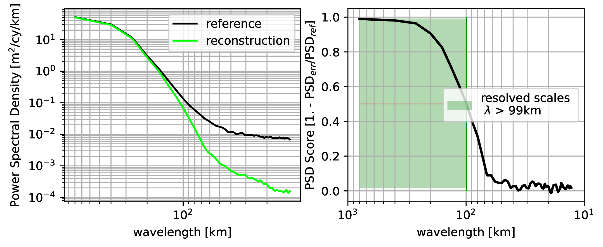
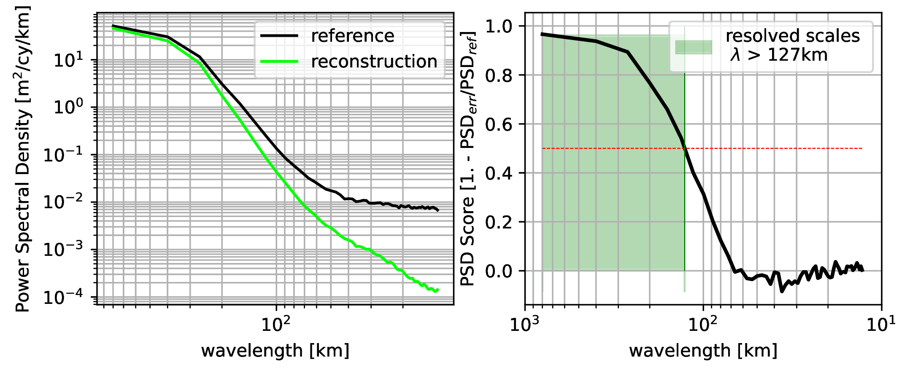
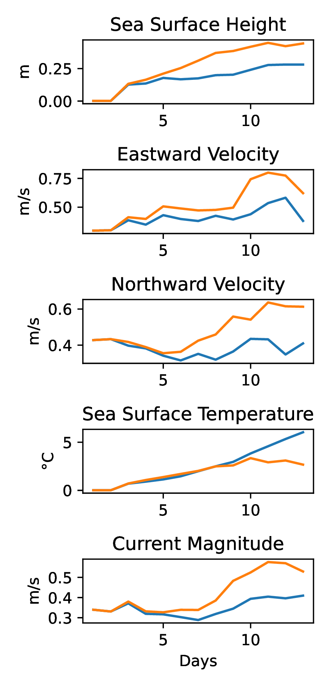
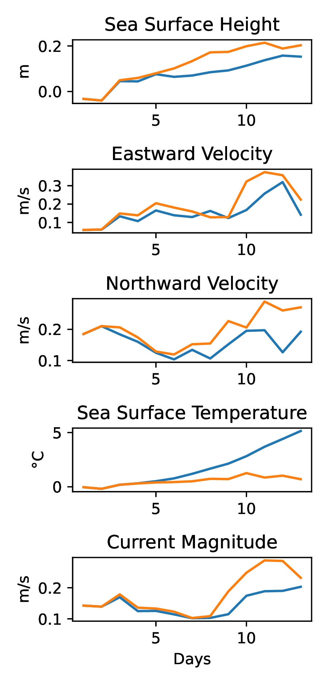
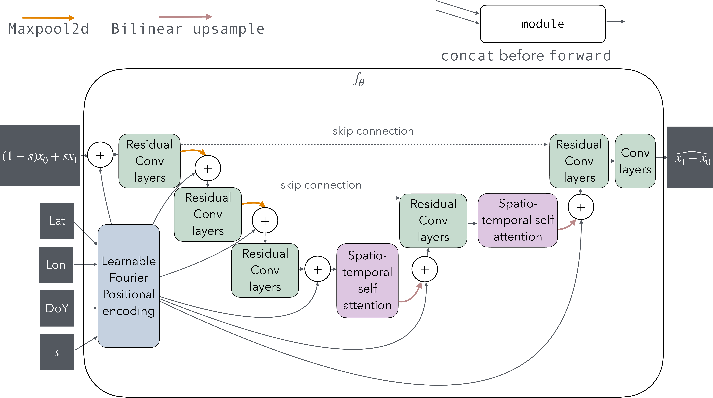

# GloFM: a Glorys Flow-Matching emulator for spatio-temporal ocean data assimilation
## Abstract
Providing regular and physically consistent predictions of the ocean state is critical for numerous scientific, operational, and societal needs. Observations of the ocean surface are gathered through various remote sensing and in situ instruments, and are typically assimilated into numerical models to reconstruct the ocean state. However, this often involves millions of data points, making it computationally intensive, which suggests deep learning may be a cheaper alternative. Deterministic data-driven approaches typically learn about ocean dynamics from numerical simulations or sparse observational data. However, such methods often lack physical realism in uncertain settings. Due to mode averaging, they produce non-physical or overly simplified states. Generative models offer a promising approach to generating physically realistic ocean states. 

We present GloFM: a Glorys Flow-Matching emulator for spatio-temporal ocean data assimilation. Our generative model produces coherent estimates of ocean surface fields. GloFM uses flow matching to assimilate observational data for nowcasting of surface currents, sea surface height (SSH), and sea surface temperature (SST). Compared to deterministic regression-based approaches, GloFM demonstrates improved realism metrics, capturing finer-scale variability and more physically plausible ocean states.

## SSH power spectral densities and score

<figure class="figure-grid" style="display:flex; flex-wrap:wrap; gap:1%; justify-content:space-between;">
  <figure style="width:49%; margin:0;">
    <h2 id="fig:duacs">
    
    </h2>
    <figcaption>PSD and score of along-track SSH for DUACS SSH OI product, and reference CryoSat-2 measurement PSD.</figcaption>
  </figure>
  <figure style="width:49%; margin:0;">
    <h2 id="fig:no_drifters">
    
    </h2>
    <figcaption>PSD and score of along-track SSH for the mean of the ensemble without drifter assimilation.</figcaption>
  </figure>
  <figure style="width:49%; margin:0;">
    <h2 id="fig:convlstm">
    
    </h2>
    <figcaption>PSD and score of along-track SSH for ConvLSTM-sst- ssh SSH fields.</figcaption>
  </figure>
  <figure style="width:49%; margin:0;">
    <h2 id="fig:drifters">
    
    </h2>
    <figcaption>PSD and score of along-track SSH for the mean of the ensemble of assimilation with drifter assimilation.</figcaption>
  </figure>
  <figcaption style="width:100%; text-align:left; margin-top:0.5rem;">
    Given Cryosat-2 observations, we sample SSH fields from each product at the measurement location. We then compute the PSD on this sequence of points, for each method and for the Croysat-2 satellite. The score reveals the wavelength at which the reconstructed fields are predicting Cryosat.
  </figcaption>
</figure>

In above figure, we compare the along-track spectral characteristics of various SSH reconstruction products. On the PSD, DUACS spikes around $3\cdot10^1$\unit{\kilo \meter} (<a href='#fig:duacs'> DUACS PSD </a>). This is due to the bicubic interpolation of DUACS on the $1/12^\circ$ grid. Our ensemble mean shows low power for small wavelength (<a href="#fig:drifters">FM drifters PSD </a> and <a href="#fig:no_drifters">FM no drifters PSD </a>). This is expected because of the averaging. For the ConvLSTM-SSH-SST, the power of the small wavelength is small thanks to mode-averaging (<a href="#fig:convlstm"> ConvLSTM-SSH-SST PSD </a>), while the score of the, well enough, resolved large wavelength of our model is lower than DUACS', and they decrease less quickly. This is why our models' RMSE is higher than DUACS' while the effective resolution of our model is lower than DUACS'.

## Using GloFM for forecast
### Forecast proposed methodology
Given a FM model trained for unconditional sampling on GLORYS, we want to estimate $p( x_1^{1:T}\mid y^{-\tau:0} )$. To do so, we compare 2 algorithms:

1) Full sequence multi-flow matching, where we directly sample $p(x_1^{-\tau:T_F}\mid y^{-\tau: 0})$, using the ODE defined in Equation \eqref{eq:post_ode}, combining the prediction of several inferences using sliding windows, and assimilating the observations of the start of the timeseries. This approach is described for DDPM models in  [[1]](#1).
2) Auto regressive Markovian generation, where we start by generating $p(x_1^{-\tau:0}\mid y^{-\tau: 0})$, then sequentially generate $p(x_1^{n}|x_1^{n-7:n-1})$, starting with $n=1$, stopping at $n=T_F$, incrementing $n$ by $1$. See Appendix~\ref{apx:ar_fcast} for details.

To sample the distribution $p( x_1^{-\tau:T_F}\mid y^{-\tau:0} )$, with $x_1^i$ the sampled states, $y^{-\tau:0}$ the observation and $v_\theta(x_s,s)$,  we first sample $p(x_1^{-\tau:0}\mid y^{-\tau:0} )$, using MMPS~\ref{eq:post_ode}. With $\tau=6$.

Then in order to sample $p(x_1^{1}\mid x_1^{-6:0})$, we use  [[1]](#1) simpler posterior sampling algorithm as MMPS algorithm complexity scales with $k^2$. In this algorithm, $A\mathbb{V}[x \mid  x_s] A^\top$ is approximated with a diagonal matrix $(1-s)\Gamma$, with $\Gamma$ set to $2I$. Using this simpler algorithm reduces the complexity of the posterior sampling but makes it less stable when assimilated observations are far away from the prior distribution.
We then sample all remaining timesteps using the same methodology, sequentially sampling $(p(x^n_1\mid x_1^{n-7:n-1}))_{n\in \{ 2\ldots T_F\}}$.

### Forecast qualitative evaluation

These algoritmhs are computationnally expansive, the few forecasting results we produced using these methods are presented in the next figures:
<figure>
 
 <figcaption>Here we show the qualitative results of full sequence sampling for forecasting, using the sliding-window posterior sampling, starting with an ensemble of RS observation assimilation (first 6 days). Note that while the Gulf-stream filament is visible even after the 13th day of the timeseries, strong gradients in the SST still disappear after the 16th day.</figcaption>
</figure>

<figure>
 
 <figcaption>Here we show the qualitative results of ensemble forecasting, using the auto-regressive posterior sampling, starting with an ensemble of RS observation assimilation (first 3 days, not displayed). Note that how the Gulf-stream filament disappears after the 4th day of forecasting.</figcaption>
</figure>

### Forecast evaluation

| RMSE                       | CRPS |
|----------------------------|------|
| |  |

<figure>
 
 <figcaption>Evaluation of the forecast fields on remote sensing and in situ observations. Evaluations of the auto-regressively generated ensembles are drawn in blue, and evaluations of the full-sequence sampling approach are drawn in orange</figcaption>
</figure>

We report the results of the ensemble forecasting, comparing the two approaches in above Figures. SST prediction metrics are better for far horizons (after 8 days of predictions for the CRPS) for the full sequence sampling approach. For other variables, the auto-regressive method provides substantially better results than the full sequence sampling approach. 

## Architecture 
UNet architecture has proven to be state-of-the-art for various image processing tasks involving image-to-image mapping. Here we use a UNet with spatio-temporal attention layers, composed of a channel-wise attention module, generating $q, k, v$ tokens from channel slices, attending channel-wise for each pixel. We then compute spatial attention on 3 by 3 windows surrounding each pixel, keeping the same channel separation. Attention can be multi-headed. We also inform our model of its inference spatio-temporal and algorithmic position using a learnable Fourier Positional Encoding module, taking latitude, longitude, day of year, and algorithmic step as input. 

# Bibliography

<a id="1">[1]</a>: François Rozet and Gilles Louppe. Score-based Data Assimilation. Advances in Neural Information Processing Systems, 36:40521–40541, December 2023. URL https://proceedings.neurips.cc/paper_files/paper/2023/hash/7f7fa581cc8a1970a4332920cdf87395-Abstract-Conference.html.

